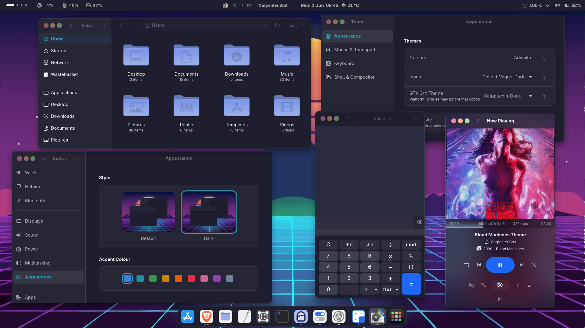
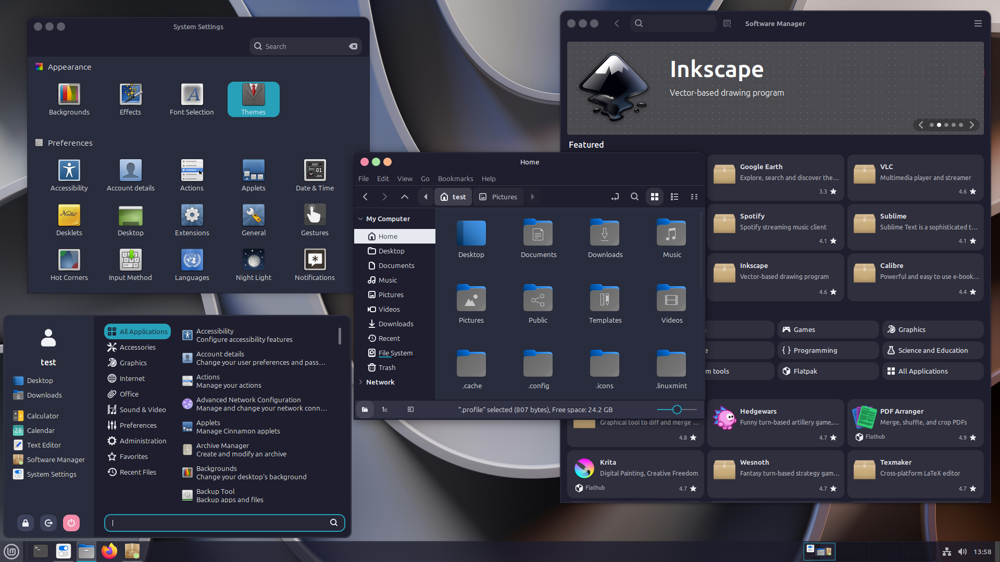
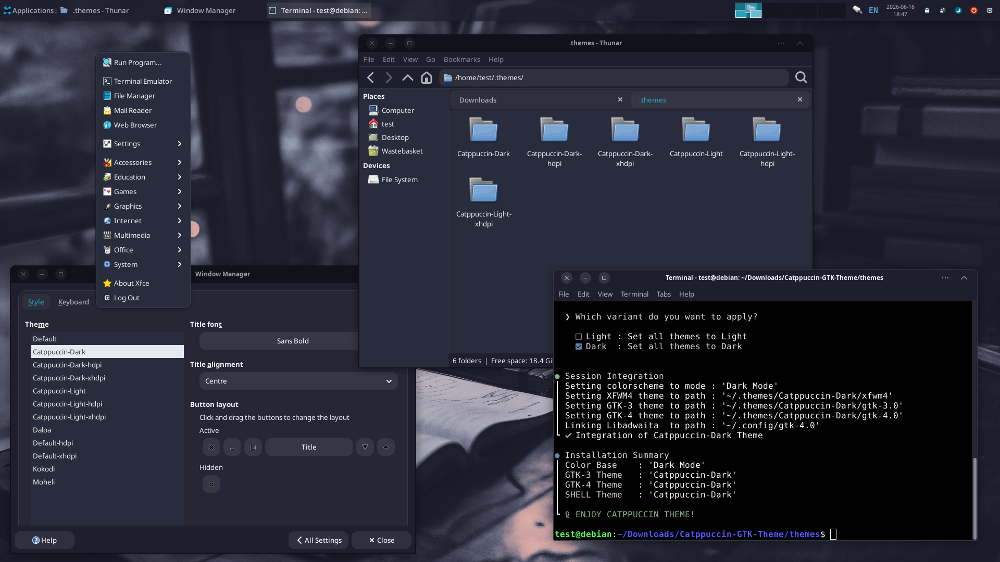

<h1 align="center">C A T P P U C C I N &nbsp; G T K &nbsp; T H E M E</h1>

<p align="center">
  A modern, clean and smoothing GTK theme based on Catppuccin’s brilliant colour
  palette, designed to transform your Linux desktop into a sophisticated
  and stylish space where you can maximize your productivity.
</p>

> [!NOTE]
> The inspiration for this theme came from my desire to have my favourite Neovim colour palettes integrated throughout my GNOME desktop.<br>
> To achieve this, I drew inspiration from the stunning GTK theme designs by [VinceLiuice](https://github.com/vinceliuice)
> and the [Gusbemacbe's](https://github.com/gusbemacbe): [Suru Plus Icon Theme](https://github.com/gusbemacbe/suru-plus).
> And, of course, from the amazing colour palettes created by each designer and community.

<p align="center">
  
  
  
  
  
</p>

<p align="center">
  
</p>

<details>
<summary>Show more Desktops Environment</summary>

| Cinnamon | XFCE |
| -------- | ---- |
|  |  |

</details>

## Variants

#### All Catppuccin + Black backgrounds

| Variant | HEX Color |
|:------- | ---------:|
| Mocha |  |
| Macchiato |  |
| Frappé |  |
| Latte |  |
| Black |  |

#### All Catppuccin accent colors

<details>
<summary>Show accents</summary>

| Name | HEX (light) | HEX (dark) |
| ---- | ----------- | ----------:|
| Blue |  | |
| Flamingo | | |
| Green | | |
| Lavender | | |
| Maroon | | |
| Mauve | | |
| Peach | | |
| Pink | | |
| Red | | |
| Rosewater | | |
| Sapphire | | |
| Sky | | |
| Teal | | |
| Yellow | | |

</details>

## Quick Install

```bash
git clone https://github.com/Fausto-Korpsvart/Catppuccin-GTK-Theme.git

cd Catppuccin-GTK-Theme
```

- Support for GTK2/3 and generic themes for some DE.

```bash
./install.sh
```

- Support for GTK4/Libadwaita with symbolic links

```bash
./install.sh -l
```

- This only simulates the installation process. (It does not generate or install the theme)

```bash
./install.sh --dry-run
```

## Advanced customisation

- Support for GTK4
- Legacy Nautilus design
- macOS window buttons

```bash
./install.sh -l --tweaks files-legacy macos
```

- 14px rounded corners for windows & Gnome Shell
- 75% transparency for Gnome Shell

```bash
./install.sh --tweaks radius 14 --shell opacity 0.75 radius 14
```

## Flatpak

- This command uses the styles from the GTK3 themes in ‘~/.themes’

```bash
sudo flatpak override --filesystem=$HOME/.themes
```

- This command uses the icon themes in ~/.icons

```bash
sudo flatpak override --filesystem=$HOME/.icons
```

- This command uses the styles from the GTK4 themes in ‘~/.config/gtk-4.0’

```bash
flatpak override --user --filesystem=xdg-config/gtk-4.0
```

## Supported Distros

- [x] Fedora Family
- [x] Debian Family
- [x] Arch Family

> [!IMPORTANT]
> Tested on the latest versions of each major distribution and their main derivatives.<br>
> It should work on other derivatives, but no official tests have been carried out.

## Documentation

A detailed guide to a deeper understanding of how it works.

- [Catppuccin Gallery](docs/GALLERY.md) — A gallery showing how the theme looks on different DE
- [Advanced Installation](docs/INSTALLATION.md) — General installation, Libadwaita, Flatpak & manual installation
- [CLI References](docs/TWEAKS.md) — Examples of how to use the CLI.

## Related Themes

| Themes Projects | GitHub Repo | Gnome Look |
| ------ |:------:|:------:|
| Catppuccin GTK | [Source](https://github.com/Fausto-Korpsvart/Catppuccin-GTK-Theme) | [Package](https://www.pling.com/p/1715554/) |
| Everforest GTK | [Source](https://github.com/Fausto-Korpsvart/Everforest-GTK-Theme) | [Package](https://www.pling.com/p/1695467/) |
| Gruvbox GTK | [Source](https://github.com/Fausto-Korpsvart/Gruvbox-GTK-Theme) | [Package](https://www.pling.com/p/1681313/) |
| Kanagawa GTK | [Source](https://github.com/Fausto-Korpsvart/Kanagawa-GKT-Theme) | [Package](https://www.pling.com/p/1810560/) |
| Material GTK | [Source](https://github.com/Fausto-Korpsvart/Material-GTK-Themes) | [Package](https://www.pling.com/p/1706139/) |
| Nightfox GTK | [Source](https://github.com/Fausto-Korpsvart/Nightfox-GTK-Theme) | [Package](https://www.pling.com/p/1929101/) |
| Osaka GTK | [Source](https://github.com/Fausto-Korpsvart/Osaka-GTK-Theme) | [Package](https://www.pling.com/p/2284009/) |
| Rose Pine GTK | [Source](https://github.com/Fausto-Korpsvart/Rose-Pine-GTK-Theme) | [Package](https://www.pling.com/p/1810530/) |
| Tokyonight GTK | [Source](https://github.com/Fausto-Korpsvart/Tokyonight-GTK-Theme) | [Package](https://www.pling.com/p/1681315/) |
| Vague GTK | [Soon](https://github.com/Fausto-Korpsvart/Vague-GTK-Theme) | [Soon](https://www.pling.com/p/) |

## Support the Project

If you enjoy the project and would like to support future development:

[](https://www.paypal.com/donate/?hosted_button_id=LKVTXNA36FTV4)
